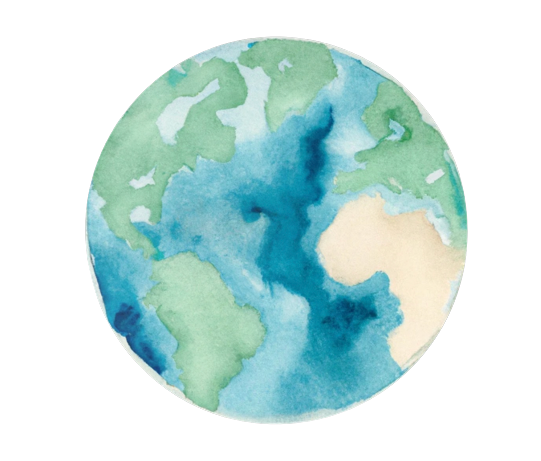

# MelXior Neural Weather App 🌤

Repository for OpenAI's Climate Hackathon **Green-Planet-Tranformers-3**'s team, in alphabetical order: [Federico Berto](https://fedebotu.github.io/), [Jared Fernandez](https://www.jaredfern.com/), [Michael Poli](https://zymrael.github.io/), [Sarthak Arora](https://sarthakvarora.github.io/) and [Sumedha Khatter](https://www.linkedin.com/in/skhatter/)

## MelXior
### Motivation
> One of the biggest problems in solving a problem like Climate Change is the lack of the awareness about the problem. People have very minuscule knowledge about this problem and thus we are trying to build a solution that can help in creating awareness to the masses.
What does our app do?

### What does our app do?
> We are investing ourselves in making people aware about the climate change problem using a weather app powered by a global neural model, which not only provides the weather conditions of a location across the globe but also suggests some easy modes of transportation that user can take, to get a lesser carbon footprint. We use a Neural Weather Forecasting model, FourCastNet model, that forecasts high-resolution timescale weather variables globally, and OpenAI APIs ( such as DALLE, GPT-3) and Text-To-Speech Problems to build the app.

### Impact on Climate Change
> Our weather app uses Weather FourcastNet model, which a NN-based weather forecast model and way more efficient than any other numerical weather models out there in the market, while having the same accuracy. The contribution to carbon footprint reduction is twofold. Inferring the neural model is >10,000x more efficient in terms of energy consumption than state-of-the-art weather models. Holistically, if we have 1M users, then and if we assume that 30% of people take the suggestions suggested by the model for just 1 kilometer, then we can reduce the carbon footprint by more than 30 tons.
## Usage

### Getting started 

To run this app locally, follow the steps:

1. Clone the repository (`git clone git@github.com:fedebotu/Green-Planet-Transformers-3.git`)
2. Create a virtual environment (`python3 -m venv venv && source venv/bin/activate`)
2. Install the requirements by running `make install`
3. Ensure your OpenAI API key is set as an environment variable `OPENAI_API_KEY` 
(see best practices around API key safety [here](https://help.openai.com/en/articles/5112595-best-practices-for-api-key-safety))
4. Run the [streamlit](https://streamlit.io/) app by running `make run`
5. Open the app in your browser at `http://localhost:8501`

### Obtain FourCastNet prediction data

Given that real time data in this format is not easily available and would require access to real-time meteorological data from the globe, we use predictions from historical data located under [`data/era5`](/data/era5) for ease of use:
- `sample.h5`: ~80 MB, contains all weather variables for the globe in one time slice (provided in Repo)
- `single_week.h5`: ~2.4 GB, contains all weather variables for the globe for one week to [[download here](https://drive.google.com/file/d/1vbR1O3Zf1fWDazs8r5n-Uoa31OLeIKeS/view?usp=sharing)]

> Note that when deployed in real time, the model needs to be run only once every 6 hours. We save inference predictions and then query them in our app, as in the files above to greatly speed up the pipeline!

### Install app requirements.txt

If you encounter issues when installing `pyaudio`, run the following: `sudo apt install portaudio19-dev`.

#### Example Qs to ask MelXior

* I wanted to go to X tomorrow. Will it rain there?
* I wanted to go to X tomorrow. Can I wear a t-shirt?
* I wanted to go to X tomorrow. Can I bike there?

Example from FourCastNet data

  

- - -

